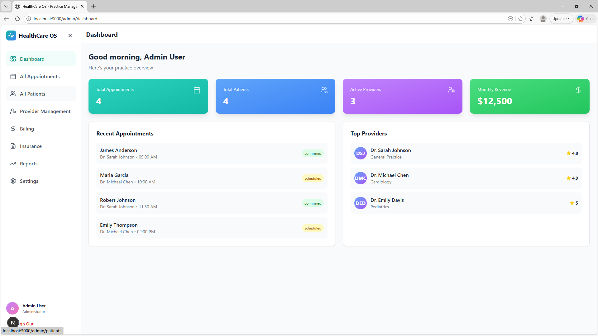
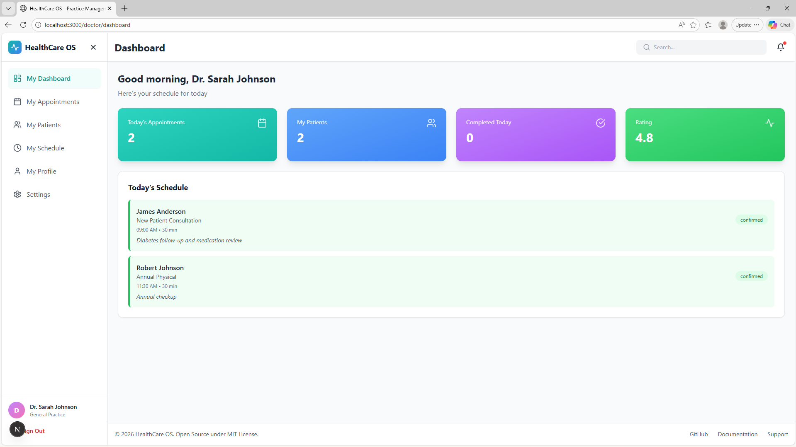
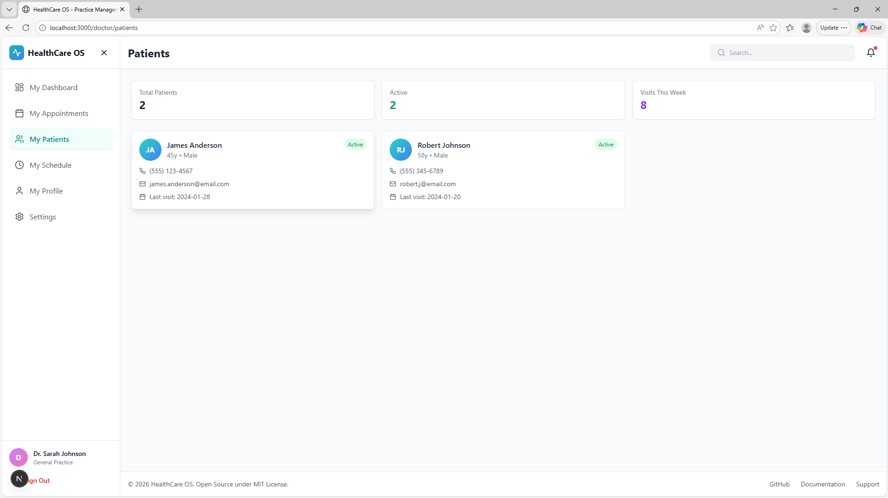
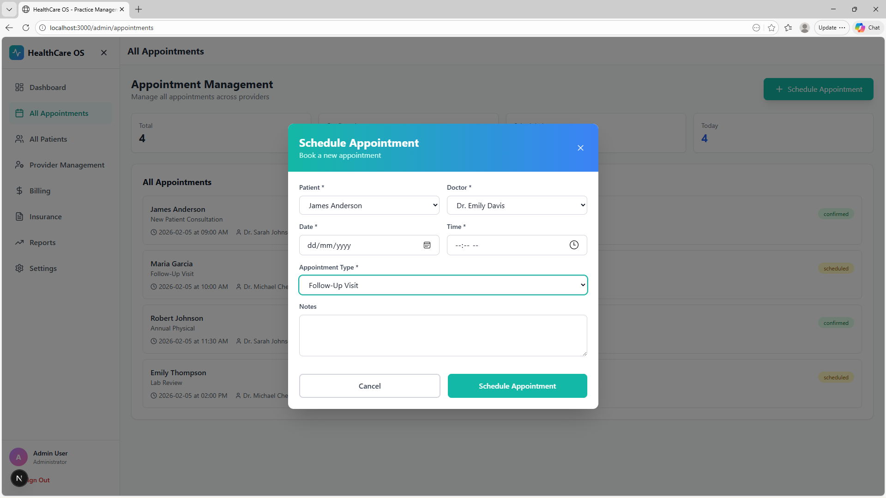

# 🏥 HealthCare OS

**Open-source practice management system for small healthcare providers**

[](https://healthcare-os.vercel.app)
[](LICENSE)
[](https://nextjs.org/)
[](https://github.com/ibrahimpelumi6142/healthcare-os)

---

## 📸 Screenshots

### 🏠 Login Page

*Secure authentication with professional healthcare design*

### 📊 Admin Dashboard

*Comprehensive practice overview with real-time statistics*

### 👨‍⚕️ Doctor Dashboard

*Personalized dashboard for healthcare providers*

### 👥 Patient Management

*Complete patient records and history tracking*

### 📅 Appointment Scheduling

*Smart booking system with calendar integration*

### 💳 Insurance Claims

*Track and manage insurance claims efficiently*

### 📈 Reports & Analytics

*Revenue trends and performance metrics*

---

## 🎯 Problem

Small healthcare practices (1-10 providers) pay $25K-$30K/year for enterprise EMR systems that are:
- 💸 **Overpriced** for their size
- 🔒 **Locked** into vendor ecosystems
- 🐌 **Complex** and bloated with unused features
- 📜 **Legacy** systems not designed for modern workflows

## 💡 Solution

HealthCare OS is a **free, open-source alternative** built with modern web technologies:

- ✅ **Free to self-host** - Zero licensing fees
- ⚡ **Modern stack** - Next.js 14, React, Tailwind CSS
- 🔌 **API-first** - Easy integrations with existing tools
- 🔐 **Privacy-focused** - You own and control your data
- 🌍 **International** - Not locked to US healthcare regulations

---

## ✨ Features

### For Practice Administrators
- 📊 **Practice Dashboard** - Real-time statistics and insights
- 👥 **Patient Management** - Complete records, history, and demographics
- 📅 **Appointment Scheduling** - Smart booking with conflict detection
- 👨‍⚕️ **Provider Management** - Manage multiple doctors and staff
- 💳 **Insurance Claims** - Track claims status and revenue
- 📈 **Reports & Analytics** - Revenue trends, patient retention, no-show rates
- 🔐 **Role-Based Access** - Admin, Doctor, and Staff permissions

### For Healthcare Providers (Doctors)
- 📋 **Personal Dashboard** - Today's schedule and patient overview
- 📅 **My Appointments** - View and manage only your appointments
- 👥 **My Patients** - Access your assigned patient list
- ⏰ **My Schedule** - Set working hours and availability
- 👤 **Profile Management** - Update credentials and biography
- ⭐ **Performance Metrics** - Patient satisfaction and statistics

---

## 🚀 Quick Start

```bash
# Clone the repository
git clone https://github.com/ibrahimpelumi6142/healthcare-os.git

# Navigate to project
cd healthcare-os

# Install dependencies
npm install

# Run development server
npm run dev
```

Open [http://localhost:3000](http://localhost:3000) in your browser.

### 🔐 Demo Credentials

**Admin Account:**
- Email: `admin@healthcare.com`
- Password: `admin123`
- Access: Full system access

**Doctor Account:**
- Email: `dr.johnson@healthcare.com`
- Password: `doctor123`
- Access: Limited to assigned patients

---

## 🛠️ Tech Stack

| Category | Technology |
|----------|------------|
| **Frontend** | Next.js 14 (App Router), React 18 |
| **Styling** | Tailwind CSS |
| **Icons** | Lucide React |
| **Authentication** | Session-based (JWT ready) |
| **Database** | In-memory (PostgreSQL/Supabase ready) |
| **Deployment** | Vercel, Netlify, or self-hosted |

---

## 📦 Deployment

### Option 1: Vercel (Recommended - Free)

```bash
# Push to GitHub
git push origin main

# Import to Vercel
# Visit vercel.com
# Click "Import Project"
# Deploy automatically

# Get live URL
# https://your-app.vercel.app
```

### Option 2: Self-Hosted

```bash
# Build for production
npm run build

# Start production server
npm start

# Application runs on port 3000
```

### Option 3: Docker (Coming Soon)

```bash
docker build -t healthcare-os .
docker run -p 3000:3000 healthcare-os
```

---

## 🗺️ Roadmap

### Phase 1: Foundation ✅
- [x] User authentication (Admin/Doctor)
- [x] Patient management
- [x] Appointment scheduling
- [x] Provider management
- [x] Basic reporting

### Phase 2: Data Persistence (Q2 2026)
- [ ] PostgreSQL/Supabase integration
- [ ] Real-time data sync
- [ ] Data backup & restore
- [ ] Audit logging

### Phase 3: Notifications (Q3 2026)
- [ ] Email notifications
- [ ] SMS reminders
- [ ] WhatsApp integration
- [ ] Push notifications

### Phase 4: Advanced Features (Q4 2026)
- [ ] Lab results integration
- [ ] Prescription management
- [ ] E-prescribing
- [ ] Document scanning & storage

### Phase 5: Expansion (2027)
- [ ] Telehealth video calls
- [ ] Mobile app (React Native)
- [ ] Multi-language support
- [ ] HIPAA compliance toolkit

---

## 🤝 Contributing

We welcome contributions from developers, healthcare professionals, and designers!

### How to Contribute

1. **Fork** the repository
2. **Create** your feature branch
   ```bash
   git checkout -b feature/AmazingFeature
   ```
3. **Commit** your changes
   ```bash
   git commit -m 'Add some AmazingFeature'
   ```
4. **Push** to the branch
   ```bash
   git push origin feature/AmazingFeature
   ```
5. **Open** a Pull Request

### Areas We Need Help

- 🎨 **UI/UX Design** - Improve user interface
- 📱 **Mobile App** - React Native development
- 🔧 **Backend** - Database integration
- 📝 **Documentation** - Improve guides
- 🌍 **Translations** - Multi-language support
- 🧪 **Testing** - Write unit and integration tests

See [CONTRIBUTING.md](CONTRIBUTING.md) for detailed guidelines.

---

## 📄 License

This project is licensed under the **MIT License** - see the [LICENSE](LICENSE) file for details.

### What This Means

✅ Commercial use allowed  
✅ Modification allowed  
✅ Distribution allowed  
✅ Private use allowed  
⚠️ Liability and warranty not provided

---

## 👨‍💻 Author

**Lasisi Ibrahim Pelumi**

Founder & Lead Software Engineer at [Devloopr Web Solution Ltd](https://devloopr.com)

- 🐙 **GitHub:** [@ibrahimpelumi6142](https://github.com/ibrahimpelumi6142)
- 💼 **LinkedIn:** [Ibrahim Lasisi](https://www.linkedin.com/in/ibrahim-lasisi-ba6192130/)
- 🌐 **Website:** [devloopr.com](https://devloopr.com)
- 📧 **Email:** contact@devloopr.com
- 📍 **Location:** Sheffield, UK

### Background

Over 10 years of experience building digital platforms with expertise in:
- Full-stack development (Node.js, React, Next.js)
- WhatsApp/Telegram automation
- API architecture & bot development
- Open-source contributions (FastAPI, Baileys, Casdoor)

---

## 🌟 Show Your Support

If this project helped you or your practice, please consider:

- ⭐ **Starring** this repository
- 🐛 **Reporting** bugs and issues
- 💡 **Suggesting** new features
- 🤝 **Contributing** code or documentation
- 📢 **Sharing** with other healthcare providers

[](https://github.com/ibrahimpelumi6142/healthcare-os)
[](https://github.com/ibrahimpelumi6142/healthcare-os)

---

## 📊 Project Stats

- 💻 **Lines of Code:** 15,000+
- 📁 **Files:** 50+
- 🎨 **UI Components:** 25+
- 🔧 **API Endpoints:** Ready for expansion
- 🌍 **Global Reach:** Designed for international use

### Portfolio Metrics (Across All Projects)

- 👁️ **Platform Views:** 2.9M+
- 👥 **Active Users:** 150K+
- 🌎 **Countries Served:** 50+
- ⭐ **Community:** Growing open-source following

---

## 🔗 Related Projects

Check out my other open-source work:

- 🤖 **[BotDev Community](https://github.com/botdev-community)** - WhatsApp bot framework
- 🛠️ **[onlinequicktools.com](https://onlinequicktools.com)** - 20+ productivity tools
- 📱 **[WorqNow.ai](https://worqnow.ai)** - WhatsApp-based AI job assistant
- 🏥 **[HealthCare OS](https://github.com/ibrahimpelumi6142/healthcare-os)** - This project!

---

## ❓ FAQ

### Is this HIPAA compliant?
Not yet. Current version is for demonstration and non-production use. HIPAA compliance toolkit is on the roadmap for 2027.

### Can I use this for my practice?
Yes! It's open-source and free. However, please note it uses in-memory storage currently. Integrate a real database for production use.

### How do I add a real database?
We're building guides for PostgreSQL and Supabase integration. Join our community for updates!

### Can I customize it?
Absolutely! Fork the repo and modify it to your needs. MIT license allows full customization.

### Do you offer support?
Community support via GitHub Issues. For commercial support, contact us at contact@devloopr.com

---

## 📞 Contact & Support

- 💬 **Issues:** [GitHub Issues](https://github.com/ibrahimpelumi6142/healthcare-os/issues)
- 📧 **Email:** ibrahimpelumi6142@gmail.com
- 🐦 **Twitter:** [@your_twitter](https://twitter.com/your_handle)
- 💼 **LinkedIn:** [Ibrahim Lasisi](https://www.linkedin.com/in/ibrahim-lasisi-ba6192130/)

---

## 🙏 Acknowledgments

- Next.js team for the amazing framework
- Tailwind CSS for the styling system
- Lucide React for the beautiful icons
- Open-source community for inspiration
- Healthcare providers who provided feedback

---

## ⚖️ Disclaimer

**For demonstration and educational purposes.**

This software is provided "as is" without warranty. Not intended for production medical use without proper testing, security audits, and compliance verification. Always consult legal and healthcare IT professionals before deploying in a medical environment.

---

<div align="center">

**Built with ❤️ for healthcare providers worldwide**

[⭐ Star this repo](https://github.com/ibrahimpelumi6142/healthcare-os) • [🐛 Report Bug](https://github.com/ibrahimpelumi6142/healthcare-os/issues) • [✨ Request Feature](https://github.com/ibrahimpelumi6142/healthcare-os/issues)

</div>
